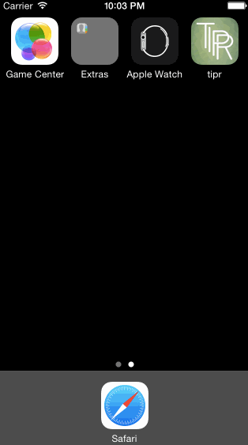

# codepath-tipr

Hello,
This is a Tipr.

I made it for my [CodePath](http://www.codepath.com) course [iOS Bootcamp for designers] (http://codepath.com/iosfordesigners) submission. It was my first time using xcode.

Time spent: 12 hours including design (art work, type and layout sourcing and creation) and development as a beginner. This is my first iOS app and I had a great time making it.

Completed user stories:

* [x] Required: Main view tip calculator
* [x] Optional: Loading view, custom type [Moon](https://www.behance.net/gallery/23468357/Moon-Free-Font) and app icon.

Notes:

- I'd like to add more view controllers

GIF created with [LiceCap](http://www.cockos.com/licecap/).
